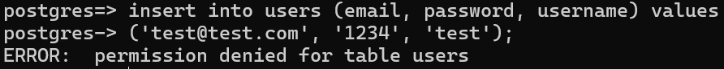

# Integrator

[Gaining access to Rasmus Kibshede postgresql DB](https://github.com/Rasmus-Kibshede/si_lecture_kea_2024/blob/main/00._Tasks/04._/04b._Database_granular_access/Exposee.md)

### Login 
Running the following in PS:
```
psql "sslmode=require hostaddr=34.159.194.199 user=guest dbname=postgres"
```

Give password when prompted:
```
GcCK60fKWJ'x
```


### Running queries

From Rasmus' guide:

| Tables  | Permissions |
| ------------- | ------------- |
| users | Only access to own data  |
| items  | Read only column name  |
| posts  | Read and write all  |
| secrets  | No Access  |

<details>
<summary>Users table</summary>
<br>

#### Insert


#### Read

</details>

<details>
<summary>Items table</summary>
<br>

#### Read

<br>


</details>

<details>
<summary>Posts table</summary>
<br>

#### Write


#### Read

</details>

<details>
<summary>Secrets table</summary>
<br>

#### Read

</details>